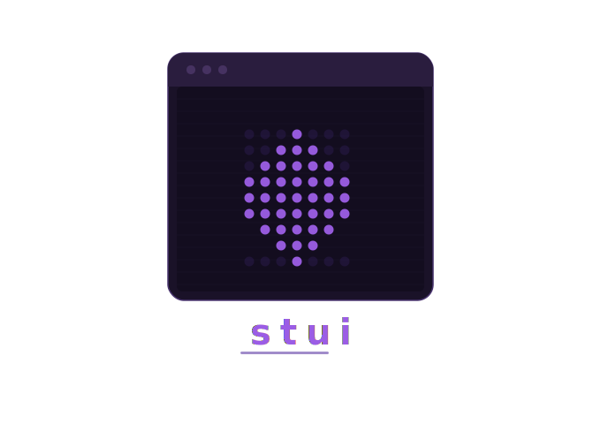

# stui

<p align="center">
  
</p>

**stui** is a plugin-driven terminal streaming platform for Linux.

A fast, audiophile friendly, feature rich and keyboard-first TUI for discovering and playing movies, series, music, radio, and podcasts — powered by a Rust async runtime, intelligent stream selection, and a fully extensible plugin system.

```
Search → Providers → Streams → Rank → Play
```

---

## Status

stui is currently in **active development, early alpha stage**.

- Core streaming, playback, and plugin system are implemented
- Most high-level features are functional
- Focus is shifting toward stability, performance, and reliability

⚠️ Expect rough edges, incomplete providers, and occasional breakage.

---

## Why stui?

stui is not just a TUI frontend — it is a **universal media runtime**.

- Decouples discovery, resolution, and playback via plugins
- Automatically ranks and selects the best stream across providers
- Tracks provider reliability and adapts over time
- Fully keyboard-driven — no mouse required
- Designed for power users who live in the terminal

Think:

> mpv + plugin ecosystem + streaming intelligence

---

## Features

### Core

- **Netflix-style poster grid** with detail overlays, cast, and similar titles
- **Episode browser** — season/episode tree for series
- **Collections & history** — resume playback and track progress
- **Universal Provider Protocol (UPP)** — one interface for all media types
- **Full DSP pipeline** — resampling, convolution, crossfeed, dither, LUFS normalization, M/S processing, and DC offset filtering for audio streams

### Playback

- **Full mpv integration**

  - subtitle delay
  - audio track switching
  - volume control
  - playback control from TUI
- **Live stream switching** — change quality without restarting playback
- **Autoplay / binge mode**
- **Smart stream ranking** — quality × latency × provider reliability

### Audio DSP

The DSP pipeline runs inside the Rust runtime and processes audio before output. All settings are configurable live from the **Audio Settings** screen (accessible via the Settings screen).

| Stage | Description |
| ----- | ----------- |
| **DC Offset Filter** | First-order IIR high-pass filter to remove DC bias and very low frequency drift |
| **Resampling** | High-quality sample rate conversion with fast / slow / synchronous filter types |
| **DSD→PCM** | Converts DSD bitstream to PCM at selectable output rate |
| **Convolution** | Room correction and impulse response convolution (WAV filter file) |
| **Crossfeed** | Headphone crossfeed with configurable feed level and lowpass cutoff |
| **LUFS Normalization** | ITU-R BS.1770-4 integrated loudness normalization with attack/release smoothing |
| **Mid/Side** | Stereo width control via M/S matrix with independent mid and side gain |
| **Dither** | TPDF dither with 9 noise shaping algorithms (Lipshitz, F-weighted, Shibata, Gesemann, and more) |

Output targets: PipeWire, ALSA (direct hw:), MPD, Roon RAAT.

Auto-detect modes: crossfeed auto-enables when headphones are detected; dither auto-enables when output is ALSA at 16-bit.

### Audio (MPD)

- **MPD music player** integration
- **Audio spectrum visualizer** with multiple backends:
  - [cava](https://github.com/cava-cava/cava) — classic frequency analyzer
  - [chroma](https://github.com/yuri-xyz/chroma) — GPU-accelerated shader visualizer
- **Visualizer modes**: bars, mirror, filled, LED
- **Peak hold indicators** for enhanced visualization
- **Configurable framerate, bars, and gradient colors**

### Streaming

- **Stream picker** with smart auto-pick
- **Benchmark progress** — visual progress bar during speed tests
- **Quality quick keys** (1-4) for instant resolution selection
- **HDR badge** and seeder count display
- **Protocol badges** (torrent, HTTP, etc.)

### Plugin System

- **RPC plugins (any language)** — Python, Go, Node, Rust
- **WASM plugins** — sandboxed execution
- **Plugin Manager** — install, update, and manage plugins
- **Plugin Repository** — community plugin sources
- **Download progress bars** with visual feedback

### UI/UX

- **Bubble Tea v2** — modern terminal UI framework
- **Virtualized lists** — efficient rendering for large lists
- **Sortable tables** — plugin manager, rating weights
- **Fractional rating bars** — compact rating display (6-8 character width)
- **Debounced search** — reduces IPC calls during typing
- **Screen transitions** — smooth animated screens
- **Modal dialogs** — confirmation prompts
- **Toast notifications** — non-blocking status messages

### Accessibility

- **High contrast mode** — optimized color palette for low vision
- **Monochrome mode** — grayscale palette for colorblind users
- **Reduced motion** — disable animations and spinners
- **Screen reader support** — ANSI escape sequences and ARIA descriptions
- **Static progress indicators** — text-based alternatives to animated elements

### System

- **Live config updates** (no restart required)
- **Settings screen** (Playback / Streaming / Subtitles / Providers / Visualizer / Accessibility / Audio DSP)
- **Audio Settings screen** — dedicated tabbed interface for all DSP pipeline settings (Output / DSP / DSD / Convolution / Crossfeed / Mid/Side / Dither)
- **Daemon mode** for persistent cache and fast startup
- **Typed IPC protocol (v1)**
- **Event-driven runtime (Tokio + EventBus)**

---

## Requirements

* Linux (Wayland or X11)
* `mpv` (required)
* `mpd` (required)
* `aria2c` (required for torrent streaming)
* `python3` (for some plugins)

Optional:

* TMDB API key (metadata)
* OpenSubtitles API key
* `cava` (for audio visualizer)
* `chroma` (for GPU-accelerated visualizer)

---

## Quickstart

```bash
# Build everything
./scripts/build.sh

# Start aria2c (required for torrent streaming)
./scripts/aria2c-start.sh
export ARIA2_SECRET=<printed secret>

# Optional: API keys
export TMDB_API_KEY=<key>
export OS_API_KEY=<opensubtitles key>

# Run (with splash screen)
./dist/stui

# Skip splash (faster for dev/CI)
./dist/stui --no-splash

# Or daemon mode (faster startup, persistent cache)
stui-runtime daemon &
stui
```

### First Run

On first launch:

- plugins are loaded
- cache is initialized
- first search may be slower than usual

---

## Keybindings

| Key           | Action      |
| ------------- | ----------- |
| `/`           | Search      |
| `?`           | Help        |
| `,`           | Settings    |
| `1–4`         | Switch tabs |
| `↑↓` / `jk`  | Navigate    |
| `enter`       | Select      |
| `esc`         | Back        |

### Playback

| Key         | Action                |
| ----------- | --------------------- |
| `space`     | Pause / resume        |
| `←/→`       | Seek ±10s             |
| `⇧←/⇧→`     | Seek ±60s             |
| `]/[`       | Volume ±5             |
| `m`         | Mute                  |
| `v` / `V`   | Cycle subtitles / off |
| `z` / `Z`   | Subtitle delay ±0.1s  |
| `X`         | Reset subtitle delay  |
| `a`         | Cycle audio track     |
| `s`         | Stream picker         |
| `n`         | Next stream candidate |
| `Q`         | Stop playback         |

### Stream Picker

| Key   | Action           |
| ----- | ---------------- |
| `tab` | Cycle sort column |
| `r`   | Reverse sort     |
| `B`   | Benchmark speeds  |
| `A`   | Smart auto-pick  |
| `1-4` | Quick quality    |

---

## Plugins

Plugins power everything in stui.

They are responsible for:

- searching content
- providing streams
- fetching subtitles
- enriching metadata

stui itself does **not** fetch media — plugins do.

### Types

**RPC plugins (recommended)**
Any language using JSON-RPC over stdio.

```bash
mkdir -p ~/.stui/plugins/my-plugin
cp my-plugin.py plugin.json ~/.stui/plugins/my-plugin/
```

**WASM plugins**
Compiled to WebAssembly for sandboxed execution.

---

## Visualizer

The audio spectrum visualizer supports two backends:

### cava (default)

Classic console-based audio visualizer. Install via your package manager:

```bash
# Arch
sudo pacman -S cava

# Debian/Ubuntu
sudo apt install cava

# Fedora
sudo dnf install cava
```

### chroma (GPU-accelerated)

Modern shader-based visualizer with more effects:

```bash
cargo install chroma --features audio
```

#### Visualizer Settings

| Setting        | Options                   | Description                    |
| -------------- | ------------------------- | ------------------------------ |
| Backend        | off / cava / chroma       | Visualizer backend             |
| Bars           | 10-60                    | Number of frequency bars       |
| Height         | 4-20                     | Visualizer height in rows      |
| Framerate     | 10-60                    | Animation speed (fps)           |
| Mode           | bars / mirror / filled / led | Visualization style        |
| Peak hold      | on / off                 | Show peak indicators           |
| Gradient       | on / off                 | Color gradient from top to bottom |
| Input method   | pulse / pipewire / alsa  | Audio input source             |

---

## Architecture

```
TUI (Go / Bubble Tea v2)
  ├── Components (spinners, tables, progress bars, visualizer)
  ├── Screens (grid, detail, stream picker, music, plugins)
  └── Theme system (colors, accessibility)
      ↓
IPC (NDJSON / Unix socket)
      ↓
Runtime (Rust / Tokio)
  ├── Engine (pipeline orchestration)
  ├── Providers (plugin interface + health + throttling)
  ├── Player (mpv integration)
  ├── Config (live updates)
  ├── Events (EventBus)
  ├── Quality (stream ranking)
  └── Music (MPD integration)
```

---

## Configuration

Configuration is managed via the Settings screen (`,`).

Categories:

- **Playback** — autoplay, volume, skip segments
- **Streaming** — benchmark, auto-delete, torrent settings
- **Subtitles** — provider, default language, styling
- **Providers** — TMDB, OpenSubtitles API keys
- **Plugins** — directory, hot reload, manager
- **Storage** — media library paths
- **Visualizer** — backend, bars, height, mode, peak hold
- **Audio DSP** — output target, sample rate, resampling, DSD, convolution, crossfeed, LUFS, M/S, dither
- **Accessibility** — color scheme, reduced motion, screen reader

---

## Development

See [DEVELOPER_SETUP.md](docs/DEVELOPER_SETUP.md) for full setup instructions.

```bash
# Go tests (TUI)
cd tui && go test ./...

# Rust tests (Runtime)
cargo test --workspace

# Code quality
./scripts/check.sh

# Build
./scripts/build.sh

# Test plugin directly
python3 plugins/torrentio-rpc/plugin.py
```

---

## Roadmap

- Improved provider ecosystem
- Better stream reliability heuristics
- Subtitle auto-sync
- Remote control / second-screen support
- Plugin registry / discovery system

---

## Disclaimer

stui does not host, store, or distribute any media.

All content is provided by third-party plugins.
Users are responsible for complying with local laws and regulations.

The core project only provides:

- a runtime
- a plugin system
- a playback interface

---
